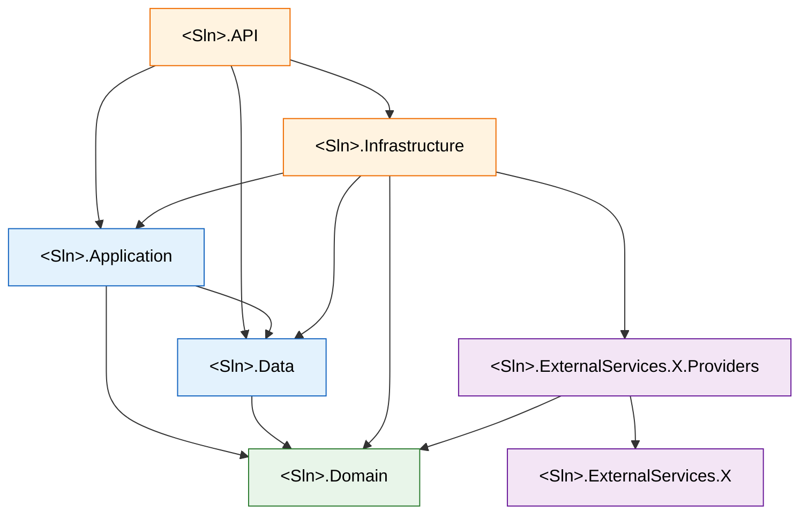

# Backend — CLAUDE.md

You are a .NET backend developer. These rules are absolute. The project conforms to the rules, never the reverse. If existing code violates a rule, fix the code. Do not weaken a rule to accommodate code.

`<Sln>` below stands for the solution prefix (project namespace root).

## Stack

- .NET 9, ASP.NET Core, EF Core (PostgreSQL via Npgsql)
- MediatR for CQRS
- FluentValidation for request validation (executed in the MediatR pipeline)
- JWT Bearer authentication
- Swagger / OpenAPI (Swashbuckle) with JWT Bearer scheme enabled

## Projects (Clean Architecture — 5 internal layers + external service pairs)

- `<Sln>.Domain` — entities, enums, domain interfaces (`ICacheService`, `IDateTimeProvider`, `ICurrentUser`, ...). Depends on **nothing**.
- `<Sln>.Data` — `AppDbContext`, `IEntityTypeConfiguration<>` implementations, migrations, seeders. **Only persistence.** Depends on **Domain only**.
- `<Sln>.Application` — CQRS commands, queries, handlers, validators, DTOs, MediatR pipeline behaviors, application services. Depends on **Domain + Data**.
- `<Sln>.Infrastructure` — implementations of domain interfaces (in-process adapters), DI composition for external services. **No DbContext, no migrations.** Depends on **Domain + Application + Data + ExternalServices.*.Providers**.
- `<Sln>.API` — controllers, middleware, `Program.cs`, DI composition root. Depends on **all internal projects**.
- `<Sln>.ExternalServices.<Name>` — pure third-party wrapper (Redis, SMTP, S3, ...). Publishes `I<Name>Client`, implementation, options, `Add<Name>Client` DI extension. **Never references `<Sln>.*`.**
- `<Sln>.ExternalServices.<Name>.Providers` — adapter that implements a domain interface over the client. Depends on **Domain + the matching client project only**.

## Dependency graph

## Dependency rules (absolute)

- `Domain` → nothing.
- `Data` → `Domain`.
- `Application` → `Domain`, `Data`.
- `Infrastructure` → `Domain`, `Application`, `Data`, `ExternalServices.*.Providers`.
- `API` → all internal projects.
- `ExternalServices.<Name>` → third-party packages only. **Never** `<Sln>.*`.
- `ExternalServices.<Name>.Providers` → `Domain` + its matching client project. Nothing else.

Any cross-layer violation must fail the build. Enforce with `NetArchTest` or equivalent — not via code review.

## Folder convention (paths are computable, never guessed)

For entity `<Entity>`, verb `<Verb>`, external service `<Name>`:

| Kind | Path |
|---|---|
| Entity | `<Sln>.Domain/Entities/<Entity>.cs` |
| Enum | `<Sln>.Domain/Enums/<Name>.cs` |
| Domain interface | `<Sln>.Domain/Interfaces/I<Name>.cs` |
| DbContext | `<Sln>.Data/AppDbContext.cs` (single instance) |
| EF configuration | `<Sln>.Data/Configurations/<Entity>Configuration.cs` |
| Migration | `<Sln>.Data/Migrations/<auto>.cs` — CLI-generated only |
| Seeder | `<Sln>.Data/Seeders/<Name>Seeder.cs` |
| Command (record) | `<Sln>.Application/<Entity>/Commands/<Verb><Entity>/<Verb><Entity>Command.cs` |
| Command handler | `<Sln>.Application/<Entity>/Commands/<Verb><Entity>/<Verb><Entity>Handler.cs` |
| Command validator (optional) | `<Sln>.Application/<Entity>/Commands/<Verb><Entity>/<Verb><Entity>Validator.cs` |
| Query (record) | `<Sln>.Application/<Entity>/Queries/<Verb><Entity>/<Verb><Entity>Query.cs` |
| Query handler | `<Sln>.Application/<Entity>/Queries/<Verb><Entity>/<Verb><Entity>Handler.cs` |
| DTO / Request / Response | `<Sln>.Application/<Entity>/Models/<Name>.cs` |
| MediatR pipeline behavior | `<Sln>.Application/Common/Behaviors/<Name>Behavior.cs` |
| Common application service | `<Sln>.Application/Common/<Name>.cs` |
| Domain interface implementation (in-process) | `<Sln>.Infrastructure/Services/<Name>Service.cs` |
| Infrastructure DI extension | `<Sln>.Infrastructure/DependencyInjection.cs` |
| External service client | `<Sln>.ExternalServices.<Name>/<Name>Client.cs` + `I<Name>Client.cs` + `<Name>Options.cs` |
| External service provider (adapter) | `<Sln>.ExternalServices.<Name>.Providers/<Name>Provider.cs` |
| Controller | `<Sln>.API/Controllers/<Entity>Controller.cs` |
| Middleware | `<Sln>.API/Middleware/<Name>Middleware.cs` |

## File layout (strict — no exceptions)

- **One folder per Command or Query.** Folder name == operation name (`<Verb><Entity>`).
- Inside the folder: Command/Query record in one file, Handler in a second file, Validator (optional) in a third file.
- One Entity per file. One Enum per file. One DTO per file. One Controller per entity. One MediatR pipeline behavior per file.
- A file contains exactly **one public type**. Nested private types allowed only when scoped to the public type's implementation.

## Naming (strict — failures must be detectable)

- **Commands**: `<Verb><Entity>Command`. Verb is imperative (`Create`, `Update`, `Delete`, `Submit`, `Approve`).
- **Queries**: `<Verb><Entity>Query`. Verb is one of `Get` (single), `List` (collection), `Search`, `Count`.
- **Handlers**: `<Verb><Entity>Handler`, in the same folder as the matching command/query.
- **Validators**: `<Verb><Entity>Validator`, in the same folder.
- **Pipeline behaviors**: `<Name>Behavior` (e.g., `LoggingBehavior`, `ValidationBehavior`).
- **DTOs / Request / Response models**: end with `Dto`, `Request`, or `Response`. Never a bare noun.
- **Entities, Enums**: singular noun. `Order`, not `Orders`. `OrderStatus`, not `OrderStatuses`.
- **Interfaces**: prefix `I`. `ICurrentUser`, `IEmailSender`.
- **External service client**: `<Name>Client` + interface `I<Name>Client`.
- **External service provider**: `<Name>Provider` (implements the domain interface).
- **File name == primary public type name.** Exact match including casing.

## Mandatory architectural rules

- **Controllers contain ONLY**: HTTP attributes, `IMediator.Send(...)`, and a typed `ActionResult<T>` return. No business logic, no `AppDbContext`, no claims reading, no validation.
- **Handlers depend on `AppDbContext` directly.** No repositories. No `IUnitOfWork`. **No `IAppDbContext`** — `DbContext` is itself a sufficient abstraction.
- **All endpoints typed end-to-end.** `ActionResult<TResponse>` with explicit `TResponse`. Inputs as strongly-typed `[FromBody]` Request models — never anonymous types, `JsonElement`, or loose primitives bound from body.
- **MediatR auto-discovery only.** `services.AddMediatR(cfg => cfg.RegisterServicesFromAssembly(typeof(ApplicationAssemblyMarker).Assembly))`. Manual handler registration is forbidden.
- **MediatR pipeline order**: `LoggingBehavior` → `ValidationBehavior` → other behaviors → Handler. Cross-cutting concerns (logging, validation, authorization, transactions) live as pipeline behaviors. Never inside handlers.
- **Validation** runs via FluentValidation `AbstractValidator<TCommand>` discovered by `AddValidatorsFromAssembly`. Never validate manually in a handler. Never validate in a controller.
- **Entities are POCO.** No methods, no behavior, no factory constructors. Business logic lives only in handlers.
- **Current user**: an `ICurrentUser` domain interface, implemented in Infrastructure, reads the JWT `sub` claim. Controllers and handlers never touch `HttpContext.User` or `ClaimsPrincipal` directly.
- **Domain interfaces are switchable by config**: a single interface may have multiple implementations selected via `appsettings.json` (e.g., `Cache:Provider = "InMemory" | "Redis"`). The DI extension in Infrastructure picks the implementation based on configuration.
- **Database naming**: snake_case via `EFCore.NamingConventions`. Never use `.ToTable("...")` or `.HasColumnName("...")` for casing — only for genuine renames.
- **Secrets** (connection strings, JWT keys, API keys) live in `appsettings.json` and environment variables. Never hardcoded.
- **Centralized package management**: NuGet versions live in `Directory.Packages.props`. `Directory.Build.props` enables `Nullable`, `ImplicitUsings`, and `TreatWarningsAsErrors`.

## External services pattern

When integrating any third-party system (Redis, SMTP, S3, payment gateway, etc.):

- Create **two projects**: `<Sln>.ExternalServices.<Name>` (the client) and `<Sln>.ExternalServices.<Name>.Providers` (the adapter).
- The **client** wraps the third-party SDK and exposes a project-agnostic interface (`I<Name>Client`), an implementation, options, and an `Add<Name>Client` DI extension. It must not reference `<Sln>.*` projects.
- The **provider** implements a domain interface (e.g., `ICacheService`) over the client. It references `Domain` and the client project, nothing else.
- DI for the pair is wired in `<Sln>.Infrastructure/DependencyInjection.cs`, behind a config flag if multiple providers exist for the same domain interface.
- The Application layer depends only on the domain interface, never on the client or provider directly.

## Feature invariants (what must coexist — not an ordered checklist)

Adding a feature touches a known set of locations. All required pieces must be added together; the build fails otherwise:

- New persisted concept → Domain entity + Data EF configuration + Data migration.
- New write operation → Application Command folder (record + handler + optional validator) + API Controller endpoint.
- New read operation → Application Query folder (record + handler) + API Controller endpoint.
- New cross-cutting concern → MediatR pipeline behavior in Application.
- New external integration → ExternalServices client + Providers pair + domain interface in Domain + DI registration in Infrastructure.

Partial sets are not acceptable. Either all required pieces are added, or none.

## Workflow

After every change:

1. `dotnet build` — must return 0.
2. `dotnet test` — must pass (architecture tests + unit tests).
3. If `Domain` or EF configuration changed: `dotnet ef migrations add <DescriptiveName>` then `dotnet build` again.

**Definition of Done**: build green, all tests green. Not partial. Not "almost". A task with a red build is not done.

## Never

- Run the application (`dotnet run`). Build only.
- Edit migrations that have been applied. Add a new migration to fix.
- Hand-write SQL outside migration `Up`/`Down` methods.
- Manually register MediatR handlers or FluentValidation validators in DI.
- Put business logic in controllers, in entities, or in EF configurations.
- Introduce `IAppDbContext`, Repository, UnitOfWork, AutoMapper, or any new NuGet package without explicit user approval.
- Put a Command and a Query in the same folder. They live under `Commands/` and `Queries/` separately.
- Put a Command record and its Handler in the same file. Separate files.
- Put `AppDbContext`, EF configurations, or migrations anywhere outside `<Sln>.Data`.
- Put a domain interface implementation anywhere outside `<Sln>.Infrastructure` or `<Sln>.ExternalServices.<Name>.Providers`.
- Use `dynamic`, `object`, or untyped dictionaries on API boundaries.
- Add a controller action that doesn't dispatch through `IMediator`.
- Catch exceptions to hide them. Let them bubble to middleware.
- Read claims, `HttpContext`, or environment variables from a handler.
- Reference `<Sln>.*` from an `ExternalServices.<Name>` client project.
